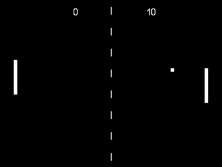

# [Lutro Pong](http://github.com/libretro/lutro-pong)

Recreation of the 1972 classic video game: [Pong](http://wikipedia.org/wiki/Pong). Built using the [Lutro game framework](http://github.com/libretro/libretro-lutro), for [Libretro/RetroArch](http://libretro.com).




## Dependencies

* [Libretro/RetroArch](http://libretro.com)
* [Lutro game framework](http://github.com/libretro/libretro-lutro)


## Usage

    retroarch -L libretro_lutro.so path/to/lutro-pong


## Development

1. Install [MoonScript](http://moonscript.org)
2. Build and run using:

  ```
  make run
  ```


## License

Licensed under the incredibly [permissive](http://en.wikipedia.org/wiki/Permissive_free_software_licence) [MIT license](http://creativecommons.org/licenses/MIT/)

Copyright &copy; Rob Loach (http://robloach.net)